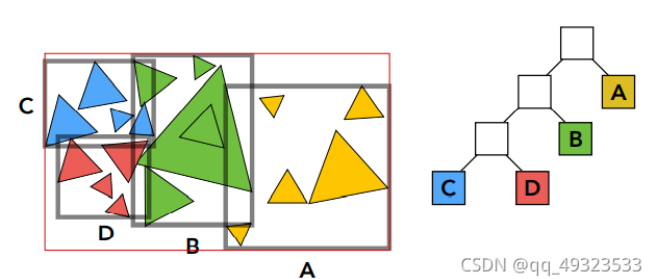

# 

ComputerGraphics

## 作业0

给定一个点P=(2,1), 将该点绕原点先逆时针旋转45◦，再平移(1,2), 计算出变换后点的坐标（要求用齐次坐标进行计算）。

- 仿射变换


$$
解:\hspace{24cm}\\
originPos=(2,1,1,0)\\TransMatrix= \begin{pmatrix}
  \cos45\degree&-sin45\degree&1&0\\
  \sin45\degree&\cos45\degree&2&0\\
  0&0&1&0\\
  0&0&0&0\\
  \end{pmatrix}^T\\
  targetPos=TransMatrix*originPos
$$

```cpp
float fcos = UKismetMathLibrary::DegCos(45);//Returns the cos of A (expects Degrees)
float fsin = UKismetMathLibrary::DegSin(45);
FPlane row1 = FPlane(fcos,-fsin,1,0);//四元数处理二维矩阵变换
FPlane row2 = FPlane(fsin,fcos,2,0);
FPlane row3 = FPlane(0,0,1,0);
FPlane row4 = FPlane(0,0,0,0);
FMatrix TransMatrix = FMatrix(row1,row2,row3,row4);
FVector4 originPos = FVector4(2,1,1,0);
TransMatrix = TransMatrix.GetTransposed();//求矩阵的转置
FVector4 res = TransMatrix.TransformFVector4(originPos);
```

## 作业1

给定三维下三个点**v0(2.0, 0.0,−2.0), v1(0.0, 2.0,−2.0), v2(−2.0, 0.0,−2.0)**, 你需要将这三个点的坐标变换为屏幕坐标并在屏幕上绘制出对应的线框三角形。简而言之，我们需要进行模型、视图、投影、视口等变换来将三角形显示在屏幕上

- 模型变换


~~~cpp
FMatrix AActor_assignment1::get_model_matrix_anyAxis(FVector axis, float rotation_angle)
{
	FMatrix model = FMatrix::Identity;//用单位矩阵初始化
	axis.Normalize(0.0001);
	FMatrix N = FMatrix(
		FPlane(0, -axis.Z, axis.Y, 0),
		FPlane(axis.Z, 0, -axis.X, 0),
		FPlane(-axis.Y, axis.X, 0, 0),
		FPlane(0, 0, 0, 0));

	FMatrix rotate4f = FMatrix::Identity * UKismetMathLibrary::DegCos(rotation_angle);
	// nnt = axis x axis的转置
	FMatrix nnT = FMatrix(
		FPlane(axis.X*axis.X, axis.X*axis.Y, axis.X*axis.Z, 0),
		FPlane(axis.Y*axis.X, axis.Y*axis.Y, axis.Y*axis.Z, 0),
		FPlane(axis.Z*axis.X, axis.Z*axis.Y, axis.Z*axis.Z, 0),
		FPlane(0, 0, 0, 0));

	rotate4f += nnT * (1 - UKismetMathLibrary::DegCos(rotation_angle));//DegCos把角度转换成弧度后cos

	rotate4f += N * UKismetMathLibrary::DegSin(rotation_angle);

	rotate4f.M[3][3] = 1;
	model = rotate4f * model;
	return model;
}
~~~

- 视口变换


~~~cpp
FMatrix AActor_assignment1::get_view_matrix(FVector eye_pos)
{
	FMatrix view = FMatrix::Identity;//单位矩阵

	FMatrix translate = FMatrix(
		FPlane(1, 0, 0, -eye_pos.X),
		FPlane(0, 1, 0, -eye_pos.Y),
		FPlane(0, 0, 1, -eye_pos.Z),
		FPlane(0, 0, 0, 1));

	view = translate * view;
	return view;
}
~~~

- 投影变换


```cpp
FMatrix AActor_assignment1::get_projection_matrix(float eye_fov, float aspect_ratio, float zNear, float zFar)//aspect ratio纵横比
{
FMatrix projection = FMatrix::Identity;
float t = zNear * UKismetMathLibrary::DegTan(eye_fov / 2);//场景top
float b = -t;//场景button
float r = t * aspect_ratio;//场景right
float l = -r;//场景left

FMatrix translate = FMatrix(//场景到屏幕的映射
FPlane(2 * zNear / (r - l), 0, -(r + l) / (r - l), 0),//r+l=0
FPlane(0, 2 * zNear / (t - b), -(t + b) / (t - b), 0),//t+b=0
FPlane(0, 0, -(zNear + zFar) / (zNear - zFar), 2 * zNear * zFar / (zNear - zFar)),
FPlane(0, 0, 1, 0));
projection = translate * projection;
return projection;
}
```
- 绘制三角形

~~~cpp
void AActor_assignment1::RasterizerDraw()
{
	FMatrix mvp = projectionMatrix * viewMatrix * modelMatrix;//MVP矩阵
	//f1 f2，用来分割像素点
	float f1 = (100 - 0.1) / 2.0;
	float f2 = (100 + 0.1) / 2.0;
	TArray<FVector4>v;
	//对每个点MVP变换
	for (FVector& p : Points) {
		v.Add(mvp.GetTransposed().TransformFVector4(FVector4(p.X, p.Y, p.Z, 1.0f)));
	}
	//顶点位置
	for (FVector4& vert : v) {
		vert *= 1 / vert.W;
		vert.X = 0.5 * width * (vert.X + 1.0);
		vert.Y = 0.5 * height * (vert.Y + 1.0);
		vert.Z = vert.Z * f1 + f2;
	}
	TArray<FVector> triangleVerts;
	for (FVector4& vert : v) {
		triangleVerts.Add(UKismetMathLibrary::Conv_Vector4ToVector(vert));//将 Vector4 转换为矢量（删除 W 元素）
	}

	// 调用AHUD 屏幕绘制函数
	AMyHUD* myHUD = Cast<AMyHUD>(UGameplayStatics::GetPlayerController(GetWorld(), 0)->GetHUD());
	if (myHUD) {
		myHUD->rasterize_wireframe(triangleVerts);
	}
}
~~~

~~~cpp
void AMyHUD::DrawHUD()
{
	Super::DrawHUD();
	if (TriangleVerts.IsValidIndex(0)) {
		DrawLine(TriangleVerts[0].X, TriangleVerts[0].Y, TriangleVerts[1].X, TriangleVerts[1].Y, FLinearColor::Red);
		DrawLine(TriangleVerts[1].X, TriangleVerts[1].Y, TriangleVerts[2].X, TriangleVerts[2].Y, FLinearColor::Red);
		DrawLine(TriangleVerts[2].X, TriangleVerts[2].Y, TriangleVerts[0].X, TriangleVerts[0].Y, FLinearColor::Red);

	}
}
~~~

## 作业2

填写并调用函数 `rasterize_triangle(const Triangle& t)`。

- 判断在三角形内部


~~~cpp
static bool insideTriangle(float x, float y, const TArray<FVector>& _v)
{
	FVector2D point = FVector2D(x, y);

	FVector2D v0 = FVector2D(_v[0].X, _v[0].Y);
	FVector2D v1 = FVector2D(_v[1].X, _v[1].Y);
	FVector2D v2 = FVector2D(_v[2].X, _v[2].Y);

	FVector2D AB = v1 - v0;
	FVector2D BC = v2 - v1;
	FVector2D CA = v0 - v2;

	FVector2D AP = point - v0;
	FVector2D BP = point - v1;
	FVector2D CP = point - v2;


	return    UKismetMathLibrary::CrossProduct2D(AB, AP) > 0
		&& UKismetMathLibrary::CrossProduct2D(BC, BP) > 0
		&& UKismetMathLibrary::CrossProduct2D(CA, CP) > 0;
}
~~~

- 遍历此bounding box 内的所有像素（使用其整数索引）。然后，使用像素中心的屏幕空间坐标来检查中心点是否在三角形内。
  - 如果在内部，则将其位置处的插值深度值(interpolated depth value) 与深度缓冲区(depth buffer) 中的相应值进行比较。
    - 如果当前点更靠近相机，请设置像素颜色并更新深度缓冲区(depth buffer)。


~~~cpp
void rst::Rasterizer2::rasterize_triangle(const Triangle2& t) {
	auto v = t.toVector4();
	// 画出三角形所在边界 AABB
	// x_l = x_min ; x_r = x_max ; y_b = y_min ; y_t = y_max
	int x_l = std::floor(std::min(v[0].X, std::min(v[1].X, v[2].X)));   //floor向下取整
	int x_r = std::ceil(std::max(v[0].X, std::max(v[1].X, v[2].X)));    //ceil向上取整
	int y_b = std::floor(std::min(v[0].Y, std::min(v[1].Y, v[2].Y)));
	int y_t = std::ceil(std::max(v[0].Y, std::max(v[1].Y, v[2].Y)));

	if (bMASS) {//在像素点取点间隔略作处理，方便观察锯齿
		// 四等分后中心点，如果像素间隔扩大，中心也相对变化
		TArray<FVector2D> posOffset = { {0.25,0.25},{0.25,0.75},{0.75,0.25},{0.75,0.75} };

		//由于过于清晰，可在此处将递增改为 5 或 10，相应四等分中心点也会变化
		for (int x = x_l; x <= x_r; x++)
			for (int y = y_b; y <= y_t; y++) {

				float minDepth = TNumericLimits<float>::Max();//初始化为无穷大
				float percentage = 0;

				for (int i = 0; i < 4; i++) {
					if (insideTriangle((float)x + posOffset[i].X, (float)y + posOffset[i].Y, t.v)) {
						//重心坐标插值
						auto BarycentricParam = computeBarycentric2D((float)x + posOffset[i].X, (float)y + posOffset[i].Y, t.v);
						float alpha = std::get<0>(BarycentricParam);
						float beta = std::get<1>(BarycentricParam);
						float gamma = std::get<2>(BarycentricParam);

						float w_reciprocal = 1.0f / (alpha / v[0].W + beta / v[1].W + gamma / v[2].W);
						float z_interpolated = alpha * v[0].Z / v[0].W + beta * v[1].Z / v[1].W + gamma * v[2].Z / v[2].W;
						z_interpolated *= w_reciprocal;
						minDepth = std::min(minDepth, z_interpolated);
						percentage += 0.25f;
					}
				}
				if (percentage > 0 && depth_buf[get_index(x, y)] > minDepth) {

					// 递增改变的话，应补充未被扫面的部分
					FVector color = t.getColor() * percentage;
					FVector point = FVector((float)x, (float)y, minDepth);
					depth_buf[get_index(x, y)] = minDepth;
					set_pixel(point, color);
				}

			}
	}
	else {
		for (int x = x_l; x <= x_r; x++)
			for (int y = y_b; y <= y_t; y++) {

				if (insideTriangle((float)x + 0.5, (float)y + 0.5, t.v)) {
					//重心坐标插值
					auto BarycentricParam = computeBarycentric2D((float)x + 0.5f, (float)y + 0.5f, t.v);
					float alpha = std::get<0>(BarycentricParam);
					float beta = std::get<1>(BarycentricParam);
					float gamma = std::get<2>(BarycentricParam);

					float w_reciprocal = 1.0f / (alpha / v[0].W + beta / v[1].W + gamma / v[2].W);
					float z_interpolated = alpha * v[0].Z / v[0].W + beta * v[1].Z / v[1].W + gamma * v[2].Z / v[2].W;
					z_interpolated *= w_reciprocal;

					if (depth_buf[get_index(x, y)] > z_interpolated) {
						FVector color = t.getColor();
						FVector point = FVector((float)x, (float)y, z_interpolated);
						depth_buf[get_index(x, y)] = z_interpolated;
						set_pixel(point, color);
					}
				}
			}
	}
}
~~~

## 作业3

实现Blinn-Phong 模型计算Fragment Color；将纹理颜色视为公式中的kd，实现Texture Shading FragmentShader；实现Bump mapping（凹凸贴图）；实现displacement mapping（位移贴图）

- Blinn-Phong模型公式

$$
Blinn-Phong反射模型=环境光+漫反射+高光\hspace{12cm}\\
L=L_a+L_d+L_s \hspace{9cm}\\
=k_aI_a+kd(I/r^2)\max(0,n\sdot l)+k_s(I/r^2)\max(0,n\sdot h)^p
$$

~~~cpp
float3 phong_fragment_shader(float3 actor_pos,float3 point_pos,float3 camera_pos,float3 normal，float3 TexctureRGB){
    float3 ka = float3(0.005,0.005,0.005);
    //float3 kd = float3(150.0,121.0,90.0)/255.0f;
    float3 kd = TextureRGB;//传入贴图信息，贴图映射
    float3 ks=float3(0.7937, 0.7937, 0.7937);

    float3 amb_light_intensity=float3(10,10,10);//光强

    float3 light[2];
    light[0]=float3(20,20,20)*40+actor_pos;
    light[1]=float3(-20,0,20)*40+actor_pos;
    float3 light_intensity=float3(500,500,500)*40*40;

    float p=150;//高光系数

    float3 La=ka*amb_light_intensity;
    float3 output_color=La;

    for(int i=0;i<2;i++){
        float3 light_dir=light[i]-point_pos;
        float3 view_dir=camera_pos-point_pos;

        float r2=dot(light_dir,light_dir);
        float3 Ld=kd*(light_intensity/r2);
        Ld *= max(0.0f, dot(normalize(normal),normalize(light_dir)));

        float3 h=normalize(normalize(light_dir) + normalize(view_dir));
        float3 Ls=ks*(light_intensity/r2);
        Ls*=pow(max(0.0f, dot(normalize(normal),h)),p);

        output_color+=Ld+Ls;
    }
    return output_color;
}
~~~

- 双线性插值处理低像素图片


~~~cpp
float3 Bilinear(float2 uv , float3 textureIn,float2 texelSize,float2 textureSize)
{
	float2 uv_img=uv*textureSize;
    float u_min=floor(uv_img.x);
    float u_max=min(textureSize.x,ceil(uv_img.x));
    float v_min=floor(uv_img.y);
    float v_max=min(textureSize.y,ceil(uv_img.y));

    float3 color00=Texture2DSample(textureIn, textureInSampler, float2(u_min,v_min)*texelSize);
    float3 color01=Texture2DSample(textureIn, textureInSampler, float2(u_max,v_min)*texelSize);
    float3 color10=Texture2DSample(textureIn, textureInSampler, float2(u_min,v_max)*texelSize);
    float3 color11=Texture2DSample(textureIn, textureInSampler, float2(u_max,v_max)*texelSize);

    float3 topColor=lerp(color00,color01,frac(uv_img.x));
    float3 bottomColor=lerp(color10,color11,frac(uv_img.x));

    float3 output_color=lerp(topColor,bottomColor,frac(uv_img.y));
    return output_color;
}
~~~

- 凹凸贴图


~~~cpp
float3 bump_fragment_shader(float2 uv, float3 TextureIn,float2 TextureSize,float3 normal)
{
    float kh=0.2;
    float kn=0.1;
    float x=normal.x;
    float y=normal.y;
    float z=normal.z;
    // 求t 注意坐标 y 和 z的变换
    float3 t = (x*z/sqrt(x*x+y*y),z*y/sqrt(x*x+y*y),sqrt(x*x+y*y));
    t = normalize(t);

    float3 b = normalize(normal * t);

    float3 u0=Texture2DSample(textureIn, textureInSampler, uv);
    float3 u1=Texture2DSample(textureIn, textureInSampler, uv+float2(texelSize.x,0));
    float3 u2=Texture2DSample(textureIn, textureInSampler, uv+float2(0,texelSize.y));

    // dU = kh * kn * (h(u+1/w,v)-h(u,v))   h代表范数（模长）
    // dV = kh * kn * (h(u,v+1/h)-h(u,v))
    float uc= (distance(u1*255,0) - distance(u0*255,0));
    float vc= (distance(u2*255,0) - distance(u0*255,0));

    float du = kh * kn * uc;
    float dv = kh * kn * vc;
    // normalize(TBN * ln) ， Matrix TBN = [t b n]
    float3 output_color = normalize(normal*1.0f - t * du - dv * b);
    return output_color;
}
~~~

- 位移贴图：将 bump_fragment_shader 中得到的法向量和位置作为光照计算公式的法向量和位置。从而产生真实的偏移效果

~~~cpp
float3 displacement_fragment_shader(float3 actor_pos,float3 point_pos,float3 camera_pos,float3 normal,float2 uv, float3 TextureIn,float2 TextureSize)
{
    float3 ka = float3(0.005,0.005,0.005);
    float3 kd = float3(150.0,121.0,90.0)/255.0f;
    float3 ks=float3(0.7937, 0.7937, 0.7937);

    float3 amb_light_intensity=float3(10,10,10);

    float3 light[2];
    light[0]=float3(20,20,20)*40+actor_pos;
    light[1]=float3(-20,0,20)*40+actor_pos;
    float3 light_intensity=float3(500,500,500)*40*40;

    float p=150;

    float kh=0.2;
    float kn=0.1;

    float x=normal.x;
    float y=normal.y;
    float z=normal.z;
    // 求t 注意坐标 y 和 z的变换
    float3 t = (x*z/sqrt(x*x+y*y),z*y/sqrt(x*x+y*y),sqrt(x*x+y*y));
    t = normalize(t);

    float3 b = normalize(normal * t);

    float3 u0=Texture2DSample(textureIn, textureInSampler, uv);
    float3 u1=Texture2DSample(textureIn, textureInSampler, uv+float2(texelSize.x,0));
    float3 u2=Texture2DSample(textureIn, textureInSampler, uv+float2(0,texelSize.y));

    // dU = kh * kn * (h(u+1/w,v)-h(u,v))   h代表范数（模长）
    // dV = kh * kn * (h(u,v+1/h)-h(u,v))
    float uc= (distance(u1*255,0) - distance(u0*255,0));
    float vc= (distance(u2*255,0) - distance(u0*255,0));

    float du = kh * kn * uc;
    float dv = kh * kn * vc;

    // Position p = p + kn * n * h(u,v)
    point_pos=point_pos+kn*normal*distance(u0*255,0)*40;
    // normalize(TBN * ln) ， Matrix TBN = [t b n]
    float3 ln=float3(-du,-dv,1.0f);
    ln=normalize(ln);
    normal = normalize( - t * ln.x - dv * ln.y + normal * ln.z);

    float3 La=ka*amb_light_intensity;
    float3 output_color=La;

    for(int i=0;i<2;i++){
        float3 light_dir=light[i]-point_pos;
        float3 view_dir=camera_pos-point_pos;

        float r2=dot(light_dir,light_dir);
        float3 Ld=kd*(light_intensity/r2);
        Ld *= max(0.0f, dot(normalize(normal),normalize(light_dir)));

        float3 h=normalize(normalize(light_dir) + normalize(view_dir));
        float3 Ls=ks*(light_intensity/r2);
        Ls*=pow(max(0.0f, dot(normalize(normal),h)),p);

        output_color+=Ld+Ls;
    }
    return output_color;
}
~~~

## 作业4

实现de Casteljau 算法来绘制由4 个控制点表示的Bézier 曲线

- 简单贝塞尔


$$
b^n(t)=b_0^n(t)=\sum_{j=0}^nb_jB_j^n(t)\\
B_i^n(t)=\begin{pmatrix}n\\i\end{pmatrix}t^i(1-t)^{n-i}
$$

~~~cpp
void AAssignment4_Actor::naive_bezier()//简单贝塞尔
{
	FVector& p_0 = m_points[0];
	FVector& p_1 = m_points[1];
	FVector& p_2 = m_points[2];
	FVector& p_3 = m_points[3];
	FVector& p_4 = m_points[4];
	for (double t = 0.0; t < 1.0; t += 0.001) {
		auto point = std::pow(1-t,4)*p_0+4*t*std::pow(1-t,3)*p_1
		+6 * std::pow(t, 2) * std::pow((1 - t), 2) * p_2 
		+ 4 * std::pow(t, 3) * (1 - t) * p_3 + std::pow(t, 4) * p_4;
		DrawDebugPoint(GetWorld(), point, 2.0f, FColor::Red, true, 5.0f);
	}
}
~~~

- 递归贝塞尔

~~~cpp
void AAssignment4_Actor::bezier()//递归贝塞尔 
{
	for (double t = 0.0; t <= 1.0; t += 0.001)
	{
		FVector point = recursive_bezier(m_points, t);
		DrawDebugPoint(GetWorld(), point, 2.0f, FColor::Green, true, 5.0f);
	}
}

FVector AAssignment4_Actor::recursive_bezier(TArray<FVector>&points, float t)
{
	if (points.Num() < 3) {
		return (1 - t) * points[0] + t * points[1];
	}
	TArray<FVector> newPoint;
	for (int i = 0; i < points.Num() - 1; i++) {
		newPoint.Add((1 - t) * points[i] + t * points[i + 1]);
	}
	return recursive_bezier(newPoint, t);
}
~~~

## 作业5

光线的生成和光线与三角的相交。

- 光线和三角面相交等价于光线和平面相交且在三角形内部

$$
\begin{bmatrix}t \\ b_1\\ b_2\end{bmatrix}=\frac{1}{\overrightarrow {S_1}\vdot \overrightarrow {E_1}}\begin{bmatrix}\overrightarrow {S_2}\vdot \overrightarrow {E_2} \\ \overrightarrow {S_1}\vdot \overrightarrow {S}\\ \overrightarrow {S_2}\vdot \overrightarrow {D}\end{bmatrix} 
$$

$$
其中:\hspace{24cm}\\\overrightarrow {E_1}=\overrightarrow {P_1}- \overrightarrow {P_0}\\\overrightarrow {E_2}=\overrightarrow {P_2}- \overrightarrow {S}\\\overrightarrow {O}=\overrightarrow {P_1}- \overrightarrow {P_0}\\ \overrightarrow {S_1}=\overrightarrow {D}\cross \overrightarrow {S_2} \\ \overrightarrow {S}=\overrightarrow {D}\cross \overrightarrow {E_1}
$$

$$
\overrightarrow{O}+t\overrightarrow{D}=(1-b_1-b_2)\overrightarrow{P_0}+b_1\overrightarrow{P_1}+b_2\overrightarrow{P_2}\\t为正合理，且若在三角形内部，重心坐标的三个系数都为正
$$

~~~cpp
//判断ray在三角形的内部还是外部
	bool rayTriangleIntersect(const FVector& v0, const FVector& v1, const FVector& v2, const FVector& orig,
		const FVector& dir, float& tnear, float& u, float& v) const
	{
		FVector E1 = v1 - v0;
		FVector E2 = v2 - v0;
		FVector S = orig - v0;
		FVector S1 = FVector::CrossProduct(dir, E2);
		FVector S2 = FVector::CrossProduct(S, E1);

		float factor = FVector::DotProduct(S1, E1);
		float t = 1.0f / factor * FVector::DotProduct(S2, E2);
		float b1 = 1.0f / factor * FVector::DotProduct(S1, S);
		float b2 = 1.0f / factor * FVector::DotProduct(S2, dir);

		if (t > 0 && b1 > 0 && b2 > 0 && (1 - b1 - b2) > 0) {
			tnear = t;
			u = b1;
			v = b2;
			return true;
		}
		return false;
	}
~~~

- 光线和球体相交

$$
Ray:r(t)=0+td,0\leqslant t< \infty\\
Sphere:(p-c)^2-R^2=0\\
联立得:\hspace{24cm}\\
at^2+bt+c=0,where\\
a=d\sdot d\\
b=2(o-c)\sdot d\\
c=(o-c)^2-R^2\\
t=\frac{-b\pm\sqrt{b^2-4ac}}{2a}取小的值
$$


~~~cpp
bool intersect(const FVector& orig, const FVector& dir, float& tnear, uint32_t&, FVector2D&) const override
{
    // analytic solution
    FVector L = orig - center;
    float a = FVector::DotProduct(dir, dir);
    float b = 2 * FVector::DotProduct(dir, L);
    float c = FVector::DotProduct(L, L) - radius2;
    float t0, t1;
    if (!solveQuadratic(a, b, c, t0, t1))
        return false;
    if (t0 < 0)
        t0 = t1;
    if (t0 < 0)
        return false;
    tnear = t0;

    return true;
}
//求交点，解二次方程
inline bool solveQuadratic(const float& a, const float& b, const float& c, float& x0, float& x1)
{
	float discr = b*b-4*a*c;
	if(discr<0) return false;
	else if (discr==0) x0 = x1 = -0.5*b/a;
	else {
		float q = (b>0)? -0.5 * (b + sqrt(discr)) : -0.5 * (b - sqrt(discr));//最近交点
		x0 = q / a;
		x1 = c / q;
	}
	if (x0>x1)
	{
		std::swap(x0,x1);
	}
	return true;
}
~~~

- 光线追踪
  - `Render()` 按行进行光线扫描，更新 Texture
  - `castRay()` 计算光照和反射后的颜色
  - `trace()` 判断光线与物体是否相交
  - `CreateTexture()` 创建 Texture

~~~cpp
//渲染过程。每次tick一行
void AActor_Assignment5::Render()
{
	FTexture2DMipMap& Mip = T_Result->PlatformData->Mips[0];
	FColor* Data = (FColor*)Mip.BulkData.Lock(LOCK_READ_ONLY);


	float scale = UKismetMathLibrary::DegTan(fov * 0.5f);
	float imageAspectRatio = width / (float)height;

	// Use this variable as the eye position to start your rays.
	FVector eye_pos = cameraComp->GetComponentLocation();
	int m = rowNumber * width;
	for (int i = 0; i < width; ++i)
	{
		// generate primary ray direction
		float pixelCenterX = (float)(i + 0.5f) / width;
		float pixelCenterY = (float)(rowNumber + 0.5f) / height;

		float x = (2 * pixelCenterX - 1) * imageAspectRatio * scale;
		float y = (1 - 2 * pixelCenterY) * scale; //轴颠倒       

		FVector dir = FVector(1, x, y); // Don't forget to normalize this direction!
		dir.Normalize();
		FVector finalColor = castRay(eye_pos, dir, 0) * 255;

		framebuffer[m] = FColor(finalColor.X, finalColor.Y, finalColor.Z, 255);
		//Data[(height - 1 - rowNumber) * width + i] = framebuffer[m];
		Data[m] = framebuffer[m]; //最终材质的颜色
		m++;//下一行
	}

	Mip.BulkData.Unlock();
	T_Result->UpdateResource();
	rowNumber++;
	if (m == width * height)
	{
		bFinishedScan = true;
		TextureFromImgArr(framebuffer);
	}
}
~~~

~~~cpp
void AActor_Assignment5::TextureFromImgArr(const TArray<FColor>& SrcData)
{
	const int32 SrcWidth = width;
	const int32 SrcHeight = height;
	// Create the texture

	//T_Result->ReleaseResource();
	// Lock the texture so it can be modified
	uint8* MipData = static_cast<uint8*>(T_Result->PlatformData->Mips[0].BulkData.Lock(LOCK_READ_WRITE));

	// Create base mip.
	uint8* DestPtr = NULL;
	const FColor* SrcPtr = NULL;
	for (int32 y = 0; y < SrcHeight; y++)
	{
		DestPtr = &MipData[(SrcHeight - 1 - y) * SrcWidth * sizeof(FColor)];
		SrcPtr = const_cast<FColor*>(&SrcData[(SrcHeight - 1 - y) * SrcWidth]);
		for (int32 x = 0; x < SrcWidth; x++)
		{
			*DestPtr++ = SrcData[SrcWidth * y + x].B;
			*DestPtr++ = SrcData[SrcWidth * y + x].G;
			*DestPtr++ = SrcData[SrcWidth * y + x].R;
			*DestPtr++ = 0xFF;
			SrcPtr++;
		}
	}

	// Unlock the texture
	T_Result->PlatformData->Mips[0].BulkData.Unlock();

	if (T_Result == nullptr)
		UKismetSystemLibrary::PrintString(GetWorld(), TEXT("T_Result is null"));
}
~~~

~~~cpp
FVector AActor_Assignment5::castRay(const FVector& orig, const FVector& dir, int depth)
{
	if (depth > maxDepth) {
		return FVector(0.0, 0.0, 0.0);
	}

	FVector hitColor = backgroundColor;
	auto payload = trace(orig, dir);//检查相交更新信息
	if (payload.IsSet())
	{
		FVector hitPoint = orig + dir * payload->tNear;//光线信息
		//UKismetSystemLibrary::DrawDebugPoint(GetWorld(), hitPoint, 1, FColor::Red, 20);
		UKismetSystemLibrary::DrawDebugLine(GetWorld(), orig, hitPoint, FColor(255, 0, 0, 48), .02f, 1.0f);

		FVector N; // normal
		FVector2D st; // st coordinates
		payload->hit_obj->getSurfaceProperties(hitPoint, dir, payload->index, payload->uv, N, st);
		switch (payload->hit_obj->materialType) {
		case EMaterialType::REFLECTION_AND_REFRACTION:
		{
			FVector reflectionDirection = reflect(dir, N);
			FVector refractionDirection = refract(dir, N, payload->hit_obj->ior);
			FVector reflectionRayOrig = (FVector::DotProduct(reflectionDirection, N) < 0) ?
				hitPoint - N * epsilon :
				hitPoint + N * epsilon;
			FVector refractionRayOrig = (FVector::DotProduct(refractionDirection, N) < 0) ?
				hitPoint - N * epsilon :
				hitPoint + N * epsilon;


			FVector	reflectionColor = castRay(reflectionRayOrig, reflectionDirection, depth + 1);//递归
			FVector refractionColor = FVector::ZeroVector;
			if (reflectionDirection.Size() != 0)
				refractionColor = castRay(refractionRayOrig, refractionDirection, depth + 1);
			float kr = fresnel(dir, N, payload->hit_obj->ior);
			hitColor = reflectionColor * kr + refractionColor * (1 - kr);
			break;

		}
		case EMaterialType::REFLECTION:
		{
			float kr = fresnel(dir, N, payload->hit_obj->ior);
			FVector reflectionDirection = reflect(dir, N);
			FVector reflectionRayOrig = (FVector::DotProduct(reflectionDirection, N) < 0) ?
				hitPoint - N * epsilon :
				hitPoint + N * epsilon;
			hitColor = castRay(reflectionRayOrig, reflectionDirection, depth + 1) * kr;
			break;
		}
		default:
		{
			// [comment]
			// We use the Phong illumation model int the default case. The phong model
			// is composed of a diffuse and a specular reflection component.
			// [/comment]
			FVector lightAmt = FVector::ZeroVector, specularColor = FVector::ZeroVector;
			FVector shadowPointOrig = (FVector::DotProduct(dir, N) < 0) ?
				hitPoint + N * epsilon :
				hitPoint - N * epsilon;
			// [comment]
			// Loop over all lights in the scene and sum their contribution up
			// We also apply the lambert cosine law
			// [/comment]
			for (auto& light_position : lights_pos) {
				FVector lightDir = light_position - hitPoint;
				// square of the distance between hitPoint and the light
				float lightDistance2 = FVector::DotProduct(lightDir, lightDir);
				lightDir.Normalize();
				float LdotN = std::max(0.f, FVector::DotProduct(lightDir, N));
				// is the point in shadow, and is the nearest occluding object closer to the object than the light itself?
				auto shadow_res = trace(shadowPointOrig, lightDir);

				bool inShadow = shadow_res.IsSet() && (shadow_res->tNear * shadow_res->tNear < lightDistance2);
				if (!inShadow)
					UKismetSystemLibrary::DrawDebugLine(GetWorld(), hitPoint, light_position, FColor(255, 0, 0, 48), .02f, 1.0f);

				lightAmt += inShadow ? FVector::ZeroVector : lights_Intensity * LdotN* FVector::OneVector;
				FVector reflectionDirection = reflect(-lightDir, N);

				specularColor += powf(std::max(0.f, -FVector::DotProduct(reflectionDirection, dir)),
					payload->hit_obj->specularExponent) * lights_Intensity* FVector::OneVector;
			}

			hitColor = lightAmt * payload->hit_obj->evalDiffuseColor(st) * payload->hit_obj->Kd + specularColor * payload->hit_obj->Ks;
			//hitColor = payload->hit_obj->evalDiffuseColor(st) * payload->hit_obj->Kd;
			break;
		}
		}
	}

	return hitColor;
}
~~~

~~~cpp
TOptional<FHit_payload> AActor_Assignment5::trace(const FVector& orig, const FVector& dir)
{
	float tNear = kInfinity;
	TOptional<FHit_payload> payload;
	for (const auto& object : objects)
	{
		float tNearK = kInfinity;
		uint32_t indexK;
		FVector2D uvK;
		if (object->intersect(orig, dir, tNearK, indexK, uvK) && tNearK <= tNear)//需要更新
		{
			payload.Emplace();
			payload->hit_obj = object;
			payload->tNear = tNearK;
			payload->index = indexK;
			payload->uv = uvK;
			tNear = tNearK;
		}
	}

	return payload;
}
~~~

~~~cpp
void AActor_Assignment5::CreateTexture()
{
	T_Result = UTexture2D::CreateTransient(width, height, PF_B8G8R8A8);//动态texture
	T_Result->UpdateResource();//更新信息
	FUpdateTextureRegion2D* RegionColor = new FUpdateTextureRegion2D(0, 0, 0, 0, width, height);

	T_Result->UpdateTextureRegions(
		(int32)0,
		(uint32)1,
		RegionColor,
		(uint32)(4 * width),
		(uint32)4,
		(uint8*)framebuffer.GetData()
	);
}
~~~

## 作业6

实现Ray-BoundingVolume 求交与BVH 查找

- 查找相交包围盒：
  - 判断求交：光线与三对面的交点：三组(tmin,tmax) 如果有交集（即有同时在三对面内的时间），则与盒子有交
    t 一定要为正！！！

~~~cpp

	 bool IntersectP(const Ray& ray, const FVector& invDir, const FVector& dirisNeg) const
	{
		// to-do
		float tEnter = -kInfinity;
		float tExit = kInfinity;
		for (int i = 0; i < 3; i++) {
			float tMin = (pMin[i] - ray.origin[i]) * invDir[i];
			float tMax = (pMax[i] - ray.origin[i]) * invDir[i];
			if (dirisNeg[i] < 0)
				std::swap(tMin, tMax);

			tEnter = std::max(tEnter, tMin);
			tExit = std::min(tExit, tMax);
		}

		return tEnter <= tExit && tExit >= 0;
	}

	 // 这个计算包围
	 void Draw(const UObject* worldContex, FLinearColor color, float time = 0.02f, float thickness = 1.5f) {
		 FVector extend = Diagonal().GetAbs() * 0.5;
		 UKismetSystemLibrary::DrawDebugBox(worldContex, Centroid(), extend, color, FRotator::ZeroRotator, time, thickness);
	}
~~~

- BVH树



~~~cpp
Intersection UBVHAccel::getIntersection(UBVHBuildNode* node, const Ray& ray) const
{
	// TODO Traverse the BVH to find intersection
	Intersection isect;
	if (node ==nullptr)
		return isect;

	FVector dirisNeg = FVector::ZeroVector; //轴正负
	dirisNeg.X = ray.direction.X > 0 ? 1 : -1;
	dirisNeg.Y = ray.direction.Y > 0 ? 1 : -1;
	dirisNeg.Z = ray.direction.Z > 0 ? 1 : -1;
	if (false == node->bounds.IntersectP(ray, ray.direction_inv, dirisNeg)) //判断是否在包围盒
		return  isect;
	
	if (node->left == nullptr && node->right == nullptr) { //直到叶子节点
		isect = node->object->getIntersection(ray);
		if(isect.happened)
			node->bounds.Draw(GetOuter()->GetWorld(), FLinearColor::Blue, 0.05f);
		return isect;
	}

	//node->bounds.Draw(worldContex, FLinearColor::Yellow, 0.1f);

	Intersection leftInter = getIntersection(node->left, ray); // 不到叶子，就一直递归下去
	Intersection rightInter = getIntersection(node->right, ray);

	return leftInter.distance < rightInter.distance ? leftInter : rightInter; //选比较近的
}
~~~

## 作业7

实现完整的Path Tracing 算法。

- 随机的出口


~~~cpp
void AHw7_Main::sampleLight(Intersection& pos, float& pdf) const
{
	float emit_area_sum = 0;
	for (int32 k = 0; k < objects.Num(); ++k) {
		if (objects[k]->hasEmit()) {
			emit_area_sum += objects[k]->getArea();
		}
	}
	float p = UKismetMathLibrary::RandomFloat() * emit_area_sum;
	emit_area_sum = 0;
	for (int32 k = 0; k < objects.Num(); ++k) {
		if (objects[k]->hasEmit()) {
			emit_area_sum += objects[k]->getArea();
			if (p <= emit_area_sum) {
				objects[k]->Sample(pos, pdf);
				break;
			}
		}
	}
}
~~~


~~~cpp
FVector AHw7_Main::castRay(const Ray& ray, int depth)
{

	Intersection hit_inter =  bvhTree->Intersect(ray); // 获取相交信息
	FVector hitColor = FVector::ZeroVector;
	if (hit_inter.happened) {
		// 判断是否直接打中发光源
		if (hit_inter.m->hasEmission()) {

			if (depth == 0) {
				// 主线程中绘制
				hitColor = hit_inter.m->getEmission();
				if (bAllowDrawDebug) {
					AsyncTask(ENamedThreads::GameThread, [=]()
						{
							UKismetSystemLibrary::DrawDebugLine(GetWorld(), ray.origin, hit_inter.coords,
								hitColor, 0.1f, 1.0f);
						}
					);
				}
				return hitColor;
			}
			else // 间接打到光源
				return FVector::ZeroVector;
		}
		//return hitColor;

		FVector hit_pos = hit_inter.coords;
		FVector hit_normal = hit_inter.normal;

		// 直接光照
		FVector L_dir = FVector::ZeroVector;
		Intersection light_inter;
		float light_pdf = 0;
		sampleLight(light_inter, light_pdf);  //随机采样光照，用采样结果判断是否打到光源

		FVector light_dir = light_inter.coords - hit_pos;
		float light_distance2 = FVector::DotProduct(light_dir, light_dir);
		light_dir.Normalize();


		Ray light_ray = Ray(hit_pos, light_dir);
		Intersection Inter_light_2_point = bvhTree->Intersect(light_ray); // 反射光线


		// 如果打到光源
		if (Inter_light_2_point.happened && Inter_light_2_point.m->hasEmission()) {
			// L_dir = L_i * f_r * cos_theta * cos_theta_x / |x-p|^2 / pdf_light
			// L_dir = emit * eval(wo , ws , N) * dot(ws , N) * dot(ws , NN) / |x-p|^2 / pdf_light

			FVector L_i = light_inter.emit;
			FVector f_r = hit_inter.m->eval(ray.direction, light_dir, hit_normal);
			float cos_theta = FVector::DotProduct(hit_normal, light_dir);
			float cos_theta_x = FVector::DotProduct(-light_dir, light_inter.normal); //此处注意向量方向
			L_dir = L_i * f_r * cos_theta * cos_theta_x / light_distance2 / light_pdf;
		}

		// 间接光照
		FVector L_indir = FVector::ZeroVector;
		if (UKismetMathLibrary::RandomFloat() < RussianRoulette) {
			FVector next_dir = hit_inter.m->sample(ray.direction, hit_normal);
			next_dir.Normalize();

			Ray next_ray(hit_pos, next_dir);
			Intersection next_hit_inter = bvhTree->Intersect(next_ray);

			if (next_hit_inter.happened && !next_hit_inter.m->hasEmission()) {
				// L_indir = shade (q, wi) * f_r * cos_theta / pdf_hemi / P_RR
				// L_indir = shade (q, wi) * eval (wo , wi , N) * dot(wi , N) / pdf(wo , wi , N) / RussianRoulette

				FVector f_r = hit_inter.m->eval(ray.direction, next_dir, hit_normal);
				float pdf = hit_inter.m->pdf(ray.direction, next_dir, hit_normal);
				float cos_theta = FVector::DotProduct(hit_normal, next_dir);
				L_indir = castRay(next_ray, depth + 1) * f_r * cos_theta / pdf / RussianRoulette;

			}
		}
		hitColor = L_dir + L_indir;
		if (bAllowDrawDebug){
			AsyncTask(ENamedThreads::GameThread, [=]()
				{

					UKismetSystemLibrary::DrawDebugLine(GetWorld(), ray.origin, hit_pos, hitColor, 0.1f, 1);
				}
		);
	}
	}
	return hitColor;
}
~~~

